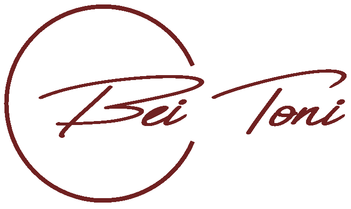

<h1 align="center">
    
</h1>

<p align="center">
    Thi is the restaurant's official website. It is built with the
    <a href="https://nextjs.org" target="_blank" rel="noreferrer">Next JS</a>
    Framework and is deployed on
    <a href="https://vercel.com" target="_blank" rel="noreferrer">Vercel</a>.
</p>


# Tech Stack

This project was built with the following technologies:
- [React](https://reactjs.org)
- [Next JS](https://nextjs.org)
- [Material UI](https://mui.com)
- [Framer Motion](https://www.framer.com/motion/)


# Project Structure

For maintainability reasons, this project is structured in a very clear
and intuitive manner:
- Components are stored each in their own directories under `/src/components`.
  This includes, but may not be limited to:
    - The component itself
    - Styles for the component
    - Framer-Motion animations
- Pages are stored under `/src/pages`, in accordance with the Next JS
  directory structure.
- More general styles and animations, as well as styles and animations for
  individual pages, are stored under `/src/styles`


# Installation

1. First, install all dependencies:

```shell
yarn install
```

2. Already, you can run this project on your local machine!

```shell
yarn dev
```

3. Alternatively, you can first build this project and then run the
   compiled code:

```shell
yarn build && yarn start
```